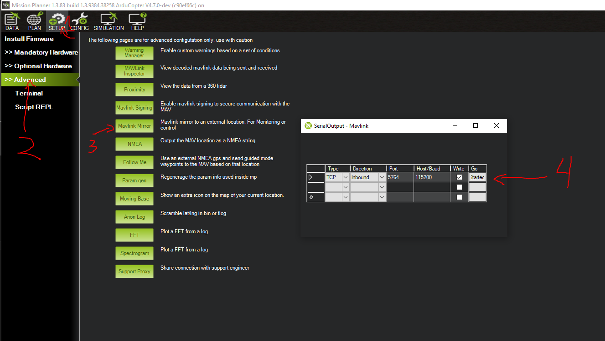

# Drone Simulator Example Script
This is a simple script which shows how a simulated Ardupilot drone can be controlled through a Python script using pymavlink.

## Usage

### Prerequisites
Before you can use this script, you must first install an [Ardupilot Simulator](https://ardupilot.org/dev/docs/simulation-2.html). 
I highly recommend [Mission Planner](https://ardupilot.org/planner/docs/mission-planner-overview.html) for this if you're on a Windows machine, but the [SITL simulator](https://ardupilot.org/dev/docs/sitl-simulator-software-in-the-loop.html#sitl-simulator-software-in-the-loop) is also an option.

You will also need Python 3 and the [pymavlink](https://pypi.org/project/pymavlink/) library.

### Starting the simulator (Mission Planner)
This script uses TCP on port 5764 to communicate with Mission Planner's SITL instance, so you will need to set up Mavlink mirroring before starting the simulator in Mission Planner. See the image below. 
**Note, you will need to click the go/started button here every time you restart mission planner**, otherwise the Python script will be unable to connect.

After this, click on the Simulation tab at the top of the window, and then click the multirotor button at the bottom. The simulation should start.

### Running the script
After the simulation is running, simply run the Python script. The drone should start moving around on its own.

## Useful Guides
Here are some guides that might be useful if you want to familiarize yourself with Ardupilot's simulator, pymavlink, and the Mavlink protocol in general.
- [Mission Planner Simulator user guide](https://www.youtube.com/watch?v=gnSbaGDzrHE): Simple tutorial which is really helpful if you haven't Mission Planner's simulator before.
- [Introduction to pymavlink playlist](https://www.youtube.com/watch?v=kecnaxlUiTY&list=PLy9nLDKxDN68cwdt5EznyAul6R8mUSNou): Good video series to familiarize yourself with using pymavlink.
- [Text based guide on getting started with pymavlink](https://mavlink.io/en/mavgen_python/)
